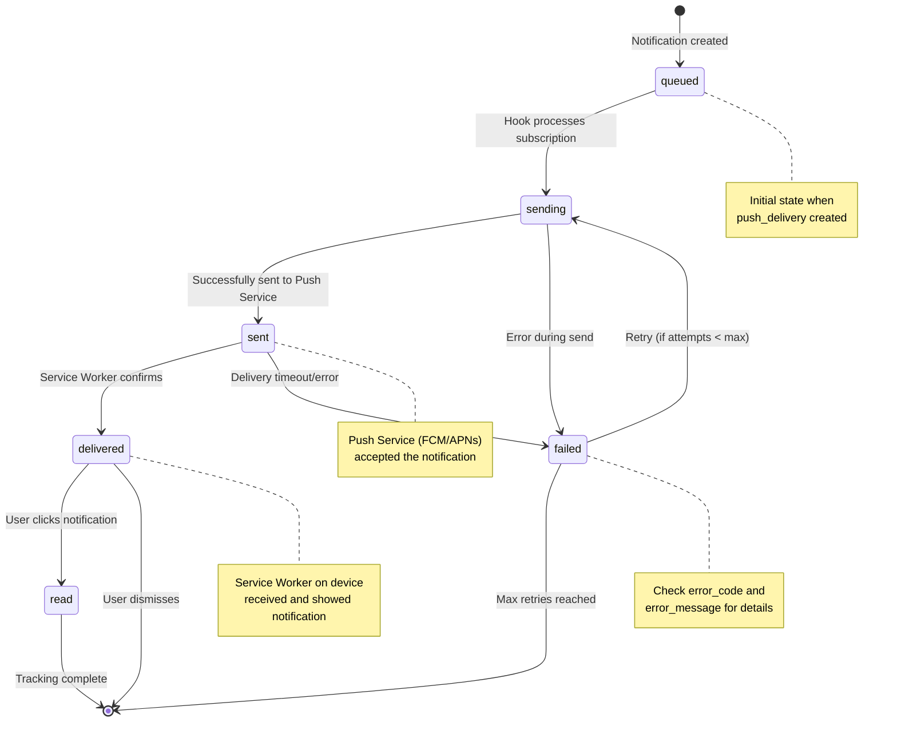

<!-- Banner: docs/banner.png -->


<br>

[](https://www.npmjs.com/package/directus-extension-push-notification)
[](https://opensource.org/licenses/MIT)
[](https://directus.io)

[Installation](#-installation) • [Quick Start](#-quick-start) • [FAQ](#-frequently-asked-questions) • [API Docs](#-api-endpoints) • [Troubleshooting](#-troubleshooting)

</div>

---

## ✨ Features

- 🔔 **Multi-device support** - One user can have multiple active subscriptions (Desktop, Mobile, Tablet)
- 📊 **Granular delivery tracking** - Track status per device (queued → sending → sent → delivered → read)
- 🔌 **Native Directus architecture** - Uses native collections and fields (no custom UI needed)
- 🌐 **Multi-channel ready** - Schema supports push, email, SMS, and in-app (currently push implemented)
- 🔄 **Automatic subscription management** - Auto-subscribe on login, soft delete on unregister
- ⚡ **Service Worker integration** - Browser notifications with delivery confirmation
- 🔐 **VAPID support** - Full Voluntary Application Server Identification
- 📝 **TypeScript support** - Fully typed codebase with strict checks
- 🧪 **Tested** - E2E tests with Playwright

## 📦 Installation

> 💡 **No external services needed!** This extension works out-of-the-box. You don't need Firebase, FCM, Google Cloud, or any third-party accounts. Just install, generate VAPID keys, and go.

### 🔒 Security Notice

**⚠️ IMPORTANT:** This project uses VAPID keys for push notifications.

**DO NOT** use the example VAPID keys from docker-compose files in production! Those keys are public and shared in documentation.

Always generate your own unique keys:

```bash
npx web-push generate-vapid-keys
```

See [SECURITY.md](SECURITY.md) for complete security guidelines.

### Via NPM/PNPM/Yarn

```bash
pnpm add directus-extension-push-notification
```

### Via Directus Marketplace

Install directly from your Directus instance Extensions panel.

> ⚠️ **Important:** This extension runs outside the sandbox (requires full system access for push notifications, service workers, and auto-setup). To see it in the Marketplace, you must set `MARKETPLACE_TRUST=all` in your Directus environment variables. [Learn more about extension trust levels](https://docs.directus.io/self-hosted/config-options.html#marketplace).

## ⚙️ Configuration

### Required: VAPID Keys (2 minutes)

**What they are:** Security keys that authenticate your push notifications. Think of them like a password between your server and browsers.

**How to generate:**

```bash
npx web-push generate-vapid-keys
```

**Add to your `.env`:**

```bash
# Required: VAPID keys for push notifications
VAPID_PUBLIC_KEY=your_public_key_here
VAPID_PRIVATE_KEY=your_private_key_here
```

⚠️ **Keep `VAPID_PRIVATE_KEY` secret!** Never commit it to Git or expose it in client code.

### Optional: VAPID Subject (Production only)

**What it is:** Identifies your server to push services (like showing caller ID).

**When to set:** Optional! If not set, the extension uses `PUBLIC_URL` automatically.

**Automatic fallback behavior:**

1. Uses `VAPID_SUBJECT` if you set it (highest priority)
2. Falls back to `PUBLIC_URL` if `VAPID_SUBJECT` is not set
3. Converts `http://` URLs to `mailto:admin@example.com` (development safe mode)

**How to set:**

```bash
# Option 1: Explicit subject (production)
VAPID_SUBJECT=https://yourdomain.com
# or
VAPID_SUBJECT=mailto:contact@yourdomain.com

# Option 2: Let it use PUBLIC_URL (recommended)
PUBLIC_URL=https://yourdomain.com  # Extension uses this automatically
```

**For development?** Nothing to do! With `PUBLIC_URL=http://localhost:8055`, the extension auto-converts to `mailto:admin@example.com`.

## 🚀 Quick Start

### Step 1: Install the Extension

```bash
pnpm add directus-extension-push-notification
```

Restart Directus. The extension automatically creates all needed collections and fields.

### Step 2: Configure VAPID Keys

Generate your keys (takes 2 seconds):

```bash
npx web-push generate-vapid-keys
```

You'll see something like:

```
=======================================
Public Key:  BPT864f6ph9v...
Private Key: xJQ5l1xcpN79...
=======================================
```

Add both to your Directus `.env` file:

```bash
VAPID_PUBLIC_KEY=BPT864f6ph9v...
VAPID_PRIVATE_KEY=xJQ5l1xcpN79...
```

Restart Directus again.

### Step 3: Enable Push for a User

1. Log into Directus admin panel
2. Go to **User Directory** → select a user
3. Scroll down and toggle **`push_enabled`** to ON
4. Save

### Step 4: Test It!

**Option A: From Directus Admin (easiest)**

1. Go to **Content** → **User Notification**
2. Click **Create Item** (+)
3. Fill in:
   - **User**: Select the user from Step 3
   - **Channel**: `push`
   - **Title**: `Hello!`
   - **Body**: `Your first notification`
4. Click **Save**

**Option B: Via API**

```bash
curl -X POST https://your-directus.com/items/user_notification \
  -H "Authorization: Bearer YOUR_TOKEN" \
  -H "Content-Type: application/json" \
  -d '{
    "user_id": "user-uuid-here",
    "channel": "push",
    "title": "Hello!",
    "body": "Your first notification"
  }'
```

### Step 5: See the Results

The notification should appear instantly on all devices where the user is logged in.

**Check delivery status:**

1. Go to **Content** → **Push Delivery**
2. You'll see a record for each device
3. Status shows: `queued` → `sent` → `delivered`

**That's it!** 🎉 Your push notifications are working.

---

### What Just Happened?

The extension automatically:

1. ✅ Found all active subscriptions for that user
2. ✅ Created delivery records for each device
3. ✅ Sent push notifications to browsers
4. ✅ Tracked delivery status per device

No Firebase setup, no complex configuration, no external services needed!

## 🌐 Browser Support

- ✅ Chrome/Edge 42+
- ✅ Firefox 44+
- ✅ Safari 16+ (macOS 13+, iOS 16.4+)
- ✅ Opera 37+

**Note:** Push notifications require HTTPS in production (except localhost for development).

## 📡 API Endpoints

All endpoints are available under `/push-notification/` prefix.

### Register Subscription

**POST** `/push-notification/register`

Register or update a device subscription for push notifications.

**Headers:**

```
Authorization: Bearer <access_token>
Content-Type: application/json
```

**Request Body:**

```json
{
  "subscription": {
    "endpoint": "https://fcm.googleapis.com/fcm/send/...",
    "keys": {
      "p256dh": "...",
      "auth": "..."
    }
  }
}
```

**Response:** `201 Created`

### Unregister Subscription

**POST** `/push-notification/unregister`

Performs a soft delete (sets `is_active: false`) to preserve delivery history.

**Request Body:** Same as register

**Response:** `200 OK`

## ❓ Frequently Asked Questions

### Do I need a Firebase/FCM account or Google Cloud project?

**No!** You don't need to create any Firebase or Google Cloud account.

The extension works directly with the browser's built-in Push API. When you see endpoints like `fcm.googleapis.com` in subscriptions, that's the browser automatically using Google's push service (Chrome/Edge use FCM, Firefox uses Mozilla Push, Safari uses APNs). This happens behind the scenes - you don't configure it.

**You only need:**

- ✅ VAPID keys (generated locally with one command)
- ✅ A Directus instance with HTTPS in production

### What are VAPID keys and why do I need them?

VAPID (Voluntary Application Server Identification) keys are like a password between your Directus server and the browser's push service. They prove that push notifications are really coming from your server.

**Think of it like this:**

- Your server needs to "sign" push notifications with a private key
- Browsers verify this signature using your public key
- This prevents anyone else from sending fake notifications to your users

**How to get them:**

```bash
npx web-push generate-vapid-keys
```

This creates a key pair in 2 seconds. Copy both keys to your `.env` file and you're done.

### How do users subscribe to notifications?

**Automatic!** When a logged-in user:

1. Has `push_enabled: true` in their profile
2. Opens your Directus admin panel

The extension automatically:

- Asks for browser notification permission (one-time popup)
- Registers their device
- They start receiving notifications immediately

Users can toggle `push_enabled` on/off anytime in their User Settings.

### Can I test this locally without HTTPS?

**Yes!** `localhost` is exempt from the HTTPS requirement. Development works fine with `http://localhost:8055`.

Production requires HTTPS (security requirement from browsers, not from us).

### Will notifications work on mobile?

**Yes!** The extension supports:

- 📱 iOS 16.4+ (Safari)
- 📱 Android (Chrome, Firefox, Edge)
- 💻 Desktop (all major browsers)

Each device gets tracked separately, so one user on desktop + mobile = 2 subscriptions = 2 deliveries.

### What happens if I delete a notification?

Deleting from `user_notification` doesn't affect already-sent push notifications (they're already on the user's device).

Delivery tracking in `push_delivery` is preserved for history/analytics even if you delete the original notification.

## 🔧 Troubleshooting

### Notifications not being delivered

1. **Check VAPID keys**: Ensure `VAPID_PUBLIC_KEY` and `VAPID_PRIVATE_KEY` match and are correctly set
2. **Check user permissions**: User must have `push_enabled: true`
3. **Check subscriptions**: User must have at least one active subscription (`is_active: true`)
4. **Check browser console**: Look for service worker errors
5. **Check delivery records**: Look at `push_delivery` collection for error details

### VAPID Subject Error

```
Error: Vapid subject is not an https: or mailto: URL
```

**Solution:** Set `VAPID_SUBJECT` or use `PUBLIC_URL` with `https://`. For development with `http://localhost`, the extension auto-converts to `mailto:`.

### Service Worker Not Registering

- Ensure you're accessing via HTTPS (or localhost for dev)
- Check browser console for errors
- Verify service worker file is accessible at `/push-notification-sw/sw.js`

### Subscription Failing

- Verify browser supports push notifications (see [Browser Support](#-browser-support))
- Check if user granted notification permissions
- Ensure VAPID public key matches between client and server

## 💡 How It Works

### Collections Created

The extension automatically creates:

**`push_subscription`** - Stores device subscriptions

- One user can have multiple devices
- Tracks endpoint, keys, user agent, device name
- `is_active` flag for soft deletes

**`user_notification`** - Notification messages

- Supports multiple channels (push, email, SMS, in-app)
- Includes title, body, icon, action URL, priority
- Can target specific users

**`push_delivery`** - Delivery tracking

- One record per notification-device pair
- Tracks status, attempts, errors, timestamps
- Enables retry logic and delivery confirmation

**`directus_users.push_enabled`** - User preference toggle

> 📖 For detailed schemas, see [Architecture Documentation](CONTRIBUTING.md#-architecture-reference)

## 📊 Understanding Delivery Status

When you send a notification, it goes through these states. You can check the **Push Delivery** collection in Directus to see where each notification is:

### Delivery Status Lifecycle



## �🔌 Client Integration Example

Here's a basic example of how to integrate push notifications in your web application:

```javascript
// Request notification permission
const permission = await Notification.requestPermission();

if (permission === "granted") {
  // Register service worker from extension endpoint
  const registration = await navigator.serviceWorker.register(
    "/extensions/push-notification-sw/sw.js",
  );

  // Subscribe to push notifications
  const subscription = await registration.pushManager.subscribe({
    userVisibleOnly: true,
    applicationServerKey: "YOUR_VAPID_PUBLIC_KEY",
  });

  // Send subscription to Directus
  await fetch("https://your-directus-instance.com/push-notification/register", {
    method: "POST",
    headers: {
      "Content-Type": "application/json",
      Authorization: "Bearer YOUR_ACCESS_TOKEN",
    },
    body: JSON.stringify({ subscription }),
  });
}
```

## 📋 Requirements

- **Directus**: 10.1.7 or higher recommended (tested on 11.15.1)
- **Node.js**: 18+ recommended
- **Valid VAPID key pair**: Generate with `npx web-push generate-vapid-keys`
- **HTTPS**: Required in production (localhost exempt for development)
- **Marketplace Trust**: Set `MARKETPLACE_TRUST=all` to install from Directus Marketplace (extension runs outside sandbox for full push notification support)

## 🔒 Security Best Practices

1. **VAPID Keys**: Keep your `VAPID_PRIVATE_KEY` secret and never expose it client-side
2. **HTTPS**: Always use HTTPS in production for secure push delivery
3. **Permissions**: Configure Directus roles to control who can send notifications
4. **Rate Limiting**: Consider implementing rate limits on notification creation
5. **User Consent**: Always request user permission before subscribing to push notifications

## 🤝 Development

Interested in contributing? Check out our [Contributing Guide](CONTRIBUTING.md) for:

- Local development setup with Docker
- Testing instructions (E2E with Playwright)
- Code standards and linting
- Release process

## 📄 License

MIT License - see [LICENSE](LICENSE) file for details.

## 💬 Support & Community

- **Issues**: [GitHub Issues](https://github.com/devix-tecnologia/directus-extension-push-notification/issues)
- **Discussions**: [GitHub Discussions](https://github.com/devix-tecnologia/directus-extension-push-notification/discussions)
- **Marketplace**: [Directus Marketplace](https://marketplace.directus.io/)

## 🙏 Acknowledgments

Built with:

- [Directus Extensions SDK](https://docs.directus.io/extensions/)
- [web-push](https://github.com/web-push-libs/web-push) library
- [Service Worker API](https://developer.mozilla.org/en-US/docs/Web/API/Service_Worker_API)

---

Made with ❤️ by [Devix Tecnologia](https://github.com/devix-tecnologia)
