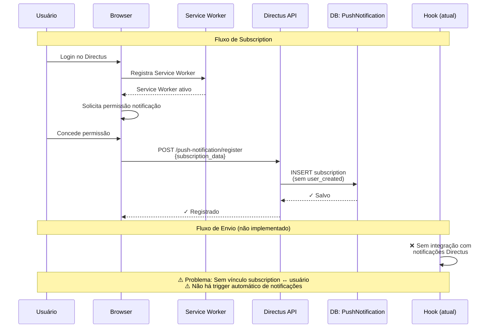
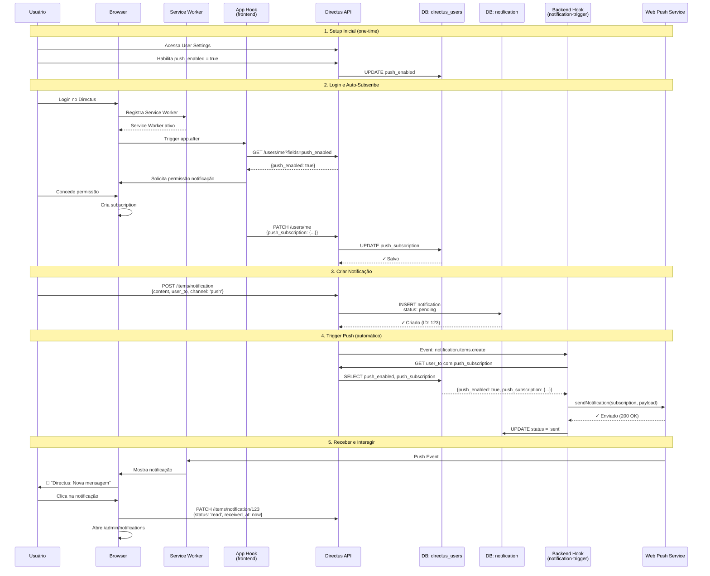
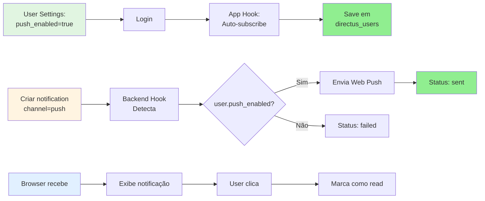

# Task 004: Implementar Push Notification com Arquitetura Nativa Directus

**Status:** `todo`  
**Priority:** `high`  
**Estimate:** `6-8h`

## Contexto

O backend já possui endpoints para registro de subscriptions (`/push-notification/register`, `/push-notification/unregister`) e envio de notificações (`/push-notification/send`), bem como a coleção `PushNotification`.

Esta task migra e expande a arquitetura atual para suportar **múltiplos dispositivos por usuário** e integração nativa com Directus:

**Mudanças principais:**

1. **Renomear `PushNotification` → `push_subscription`** - Com campos adicionais para múltiplos dispositivos
2. **Adicionar campo em `directus_users`** - `push_enabled` para controle global
3. **Criar coleção `notification`** - Registro centralizado de todas as notificações (push, email, SMS, in-app)
4. **Service Worker** - Para receber push notifications no browser
5. **Hook backend** - Para enviar push quando uma notification for criada
6. **Hook frontend (app extension)** - Para auto-subscribe ao fazer login

**Suporte a múltiplos dispositivos:**

- 1 usuário pode ter N subscriptions (Desktop, Mobile, Tablet, etc)
- Cada dispositivo identificado por `user_agent` e `device_name` opcional
- Usuário pode gerenciar e remover dispositivos individualmente

## Objetivo

Migrar e implementar push notifications com suporte a múltiplos dispositivos:

1. **Migrar `PushNotification` → `push_subscription`** - Adicionar campos para múltiplos dispositivos
2. **Adicionar campo em `directus_users`** - `push_enabled` para controle global
3. **Criar coleção `notification`** - Registro multi-canal de notificações
4. **Implementar Service Worker** - Receber push no browser
5. **Criar hook backend** - Escuta criação de notifications e envia push para todos os dispositivos
6. **Criar hook frontend** - Auto-subscribe ao fazer login
7. **Gerenciar preferências** - Via interface nativa do Directus (User Settings)

## Vantagens da Abordagem

1. ✅ **Múltiplos dispositivos** - 1 usuário pode ter N subscriptions (Desktop, Mobile, etc)
2. ✅ **Identificação de dispositivos** - `user_agent` + `device_name` opcional
3. ✅ **Gerenciável** - Usuário pode ver e remover dispositivos individualmente
4. ✅ **Sem UI customizada** - Usa formulários nativos do Directus
5. ✅ **Permissões integradas** - Sistema de permissões do Directus funciona automaticamente
6. ✅ **Multi-canal** - Coleção `notification` suporta push, email, SMS, in-app
7. ✅ **Auditável** - Histórico completo de notificações enviadas
8. ✅ **Testável** - Inserir notification via API ou interface para testar
9. ✅ **Directus-native** - Aproveita infraestrutura existente

## Comparação de Arquiteturas

### 📊 Arquitetura Atual (com coleção PushNotification)



### 📊 Nova Arquitetura (com directus_users + notification)



### 🔄 Diferenças Principais

| Aspecto                    | Arquitetura Atual          | Nova Arquitetura                         |
| -------------------------- | -------------------------- | ---------------------------------------- |
| **Storage Subscription**   | Coleção `PushNotification` | Campo `directus_users.push_subscription` |
| **Vínculo User**           | ❌ Não existe              | ✅ Direto em users                       |
| **Histórico Notificações** | ❌ Não rastreado           | ✅ Coleção `notification`                |
| **Trigger Automático**     | ❌ Manual via endpoint     | ✅ Hook em `notification.items.create`   |
| **Multi-canal**            | ❌ Só push                 | ✅ push/email/sms/in-app                 |
| **Status Tracking**        | ❌ Não existe              | ✅ pending→sent→delivered→read           |
| **Auto-subscribe**         | ❌ Não implementado        | ✅ App hook no login                     |
| **UI Management**          | ❌ Precisa criar Panel     | ✅ User Settings nativo                  |
| **Múltiplos dispositivos** | ✅ Suporta                 | ⚠️ 1 subscription por user (limitação)   |

### 🎯 Fluxo Simplificado (Nova Arquitetura)



## Arquitetura Proposta

### 1. Estrutura de Dados

#### Campo em `directus_users`

Adicionar via hook de inicialização ou migration:

- `push_enabled` (boolean, default: false) - Controle global: usuário quer receber push notifications

**Localização:** `src/db-configuration/users-fields.ts` ou adicionar em `index.ts`

#### Migrar `PushNotification` → `push_subscription`

**Ação:** Renomear coleção existente e adicionar campos para suporte a múltiplos dispositivos

**Estrutura final (dispositivo que recebe push):**

- `id` (uuid, primary key) - ✅ Já existe
- `user_id` (uuid, m2o → directus_users, required) - **NOVO** - Dono da subscription
- `endpoint` (text, unique, required) - ✅ Já existe (migrar de `subscription_data.endpoint`)
- `keys` (json, required) - ✅ Já existe (migrar de `subscription_data.keys` - formato: {p256dh, auth})
- `user_agent` (string, nullable) - **NOVO** - Identificar dispositivo (ex: "Chrome 120 / macOS")
- `device_name` (string, nullable) - **NOVO** - Nome amigável opcional (ex: "MacBook Pro", "iPhone 13")
- `is_active` (boolean, default: true) - **NOVO** - Se a subscription está ativa
- `created_at` (timestamp, auto) - ✅ Já existe (renomear de `date_created`)
- `last_used_at` (timestamp, nullable) - **NOVO** - Último uso da subscription
- `expires_at` (timestamp, nullable) - **NOVO** - Expiração da subscription

**Campos a remover:**

- `subscription_data` (json) - Será substituído por `endpoint` + `keys` separados
- `date_created` → `created_at`
- `date_updated` (não necessário)

**Localização:** `src/db-configuration/push-subscription-collection.ts` (atualizar schema existente)

**Migração de dados (se houver subscriptions existentes):**

```sql
-- Exemplo conceitual (será feito via hook)
UPDATE push_subscription
SET
  endpoint = JSON_EXTRACT(subscription_data, '$.endpoint'),
  keys = JSON_EXTRACT(subscription_data, '$.keys'),
  user = NULL, -- Precisa ser associado manualmente ou via próximo login
  user_agent = NULL,
  device_name = NULL;
```

#### Nova coleção `user_notification`

Mensagem de negócio (notificação para usuário):

- `id` (uuid, primary key)
- `title` (string, required) - Título da notificação
- `body` (text, required) - Corpo/conteúdo da mensagem
- `user_id` (uuid, m2o → directus_users, required) - Destinatário
- `channel` (string, dropdown: 'push', 'email', 'sms', 'in_app') - Canal de entrega
- `priority` (string, dropdown: 'low', 'normal', 'high', 'urgent', default: 'normal') - Prioridade
- `action_url` (string, nullable) - URL ao clicar na notificação
- `icon_url` (string, nullable) - Ícone customizado
- `data` (json, nullable) - Dados adicionais para o app
- `created_by` (uuid, m2o → directus_users, nullable) - Quem criou (pode ser sistema)
- `created_at` (timestamp, auto)
- `expires_at` (timestamp, nullable) - Expiração da notificação

**Nota:** Status e timestamps de entrega agora ficam na tabela de relacionamento `push_delivery`

**Localização:** `src/db-configuration/user-notification-collection.ts` ou adicionar em `index.ts`

#### Nova coleção `push_delivery` (Join Table)

Evento de entrega de push (rastreia cada tentativa de envio):

- `id` (uuid, primary key)
- `user_notification_id` (uuid, m2o → user_notification, required) - Qual notificação
- `push_subscription_id` (uuid, m2o → push_subscription, required) - Qual dispositivo
- `status` (string, dropdown: 'queued', 'sending', 'sent', 'delivered', 'read', 'failed', 'expired') - Status do delivery
- `attempt_count` (integer, default: 0) - Número de tentativas de envio
- `max_attempts` (integer, default: 3) - Máximo de tentativas
- `queued_at` (timestamp, auto) - Quando entrou na fila
- `sent_at` (timestamp, nullable) - Quando foi enviado para Push Service
- `delivered_at` (timestamp, nullable) - Quando chegou no dispositivo (Service Worker)
- `read_at` (timestamp, nullable) - Quando usuário clicou/leu
- `failed_at` (timestamp, nullable) - Quando falhou definitivamente
- `error_code` (string, nullable) - Código do erro (ex: "410", "INVALID_SUBSCRIPTION")
- `error_message` (text, nullable) - Mensagem de erro detalhada
- `retry_after` (timestamp, nullable) - Quando tentar novamente (para retry)
- `metadata` (json, nullable) - Dados adicionais (headers, response, etc)

**Índices recomendados:**

- `user_notification_id` + `push_subscription_id` (unique composite) - Prevenir duplicatas
- `user_notification_id` - Buscar todos deliveries de uma notificação
- `push_subscription_id` - Histórico de deliveries por dispositivo
- `status` - Filtrar por status
- `queued_at`, `retry_after` - Processar fila

**Localização:** `src/db-configuration/push-delivery-collection.ts` ou adicionar em `index.ts`

### 2. Service Worker

**Localização:** `src/push-notification/service-worker.js`

**Referência:** `exemplos/push-notification/src/service-worker.js`

```javascript
// Service Worker para receber e exibir push notifications
self.addEventListener('push', function(event) {
  const data = event.data ? event.data.json() : {};

  const options = {
    body: data.body || 'Nova notificação do Directus',
    icon: data.icon_url || '/admin/favicon.ico',
    badge: '/admin/favicon.ico',
    tag: data.user_notification_id || 'directus-notification',
    data: {
      url: data.action_url || '/admin/notifications',
      user_notification_id: data.user_notification_id,
      push_delivery_id: data.push_delivery_id // ID da join table
    },
    requireInteraction: data.priority === 'urgent' || data.priority === 'high'
  };

  event.waitUntil(
    Promise.all([
      // Exibe a notificação
      self.registration.showNotification(data.title || 'Directus', options),

      // Confirma entrega (delivered) ao backend na push_delivery
      data.push_delivery_id ? fetch(`/items/push_delivery/${data.push_delivery_id}`, {
        method: 'PATCH',
        headers: { 'Content-Type': 'application/json' },
        body: JSON.stringify({
          status: 'delivered',
          delivered_at: new Date().toISOString()
        })
      }).catch(err => console.error('Erro ao confirmar entrega:', err)) : Promise.resolve()
    ])
  );
});

self.addEventListener('notificationclick', function(event) {
  event.notification.close();

  // Marca como LIDA (read) na push_delivery
  if (event.notification.data.push_delivery_id) {
    fetch(`/items/push_delivery/${event.notification.data.push_delivery_id}`, {
      method: 'PATCH',
      headers: { 'Content-Type': 'application/json' },
      body: JSON.stringify({
        status: 'read',
        read_at: new Date().toISOString()
      })
    }).catch(err => console.error('Erro ao marcar notificação como lida:', err));
  }
  }
  }

  // Abre o painel de notificações do Directus
  event.waitUntil(
    clients.openWindow(event.notification.data.url)
  );
});
```

### 3. PushNotificationService

**Localização:** `src/push-notification/PushNotificationService.ts`

**Referência:** `exemplos/vue-push-notification-service/src/services/push-notification-service.ts`

```typescript
import { urlBase64ToUint8Array } from "./utils";

const VAPID_PUBLIC_KEY =
  process.env.VAPID_PUBLIC_KEY || "BPT864f6ph9vkIXmyWJFsehe...";

export class PushNotificationService {
  private registration: ServiceWorkerRegistration | null = null;

  async init(): Promise<boolean> {
    if (!("serviceWorker" in navigator) || !("PushManager" in window)) {
      console.warn("Push notifications not supported");
      return false;
    }

    try {
      this.registration =
        await navigator.serviceWorker.register("/service-worker.js");
      console.log("Service Worker registered");
      return true;
    } catch (error) {
      console.error("Service Worker registration failed:", error);
      return false;
    }
  }

  async subscribe(): Promise<boolean> {
    if (!this.registration) {
      const initialized = await this.init();
      if (!initialized) return false;
    }

    try {
      // Solicitar permissão
      const permission = await Notification.requestPermission();
      if (permission !== "granted") {
        console.log("Push notification permission denied");
        return false;
      }

      // Criar subscription
      const subscription = await this.registration!.pushManager.subscribe({
        userVisibleOnly: true,
        applicationServerKey: urlBase64ToUint8Array(VAPID_PUBLIC_KEY),
      });

      // Salvar subscription no backend (em directus_users)
      await this.saveSubscription(subscription);

      console.log("Push subscription created and saved");
      return true;
    } catch (error) {
      console.error("Failed to subscribe to push notifications:", error);
      return false;
    }
  }

  async unsubscribe(): Promise<boolean> {
    if (!this.registration) return false;

    try {
      const subscription =
        await this.registration.pushManager.getSubscription();

      if (subscription) {
        await subscription.unsubscribe();
        await this.removeSubscription();
        console.log("Push subscription removed");
      }

      return true;
    } catch (error) {
      console.error("Failed to unsubscribe:", error);
      return false;
    }
  }

  async isSubscribed(): Promise<boolean> {
    if (!this.registration) {
      await this.init();
    }

    const subscription = await this.registration?.pushManager.getSubscription();
    return !!subscription;
  }

  private async saveSubscription(
    subscription: PushSubscription,
  ): Promise<void> {
    const subscriptionData = subscription.toJSON();

    // Extrair user agent para identificar dispositivo
    const userAgent = navigator.userAgent;

    const response = await fetch("/items/push_subscription", {
      method: "POST",
      headers: { "Content-Type": "application/json" },
      body: JSON.stringify({
        endpoint: subscriptionData.endpoint,
        keys: subscriptionData.keys,
        user_agent: userAgent,
        device_name: null, // Pode ser preenchido depois pelo usuário
        is_active: true,
      }),
    });

    if (!response.ok) {
      throw new Error("Failed to save subscription");
    }
  }

  private async removeSubscription(): Promise<void> {
    const subscription = await this.registration?.pushManager.getSubscription();
    if (!subscription) return;

    const endpoint = subscription.endpoint;

    // Buscar ID da subscription pelo endpoint
    const searchResponse = await fetch(
      `/items/push_subscription?filter[endpoint][_eq]=${encodeURIComponent(endpoint)}`,
    );
    const data = await searchResponse.json();

    if (data.data && data.data.length > 0) {
      const subscriptionId = data.data[0].id;

      // Marcar como inativa ao invés de deletar (preserva histórico)
      await fetch(`/items/push_subscription/${subscriptionId}`, {
        method: "PATCH",
        headers: { "Content-Type": "application/json" },
        body: JSON.stringify({ is_active: false }),
      });
    }
  }
}
```

### 4. Utility Function

**Localização:** `src/push-notification/utils.ts`

**Referência:** `exemplos/vue-push-notification-service/src/utils/functions.ts`

```typescript
/**
 * Converte VAPID key de base64 para Uint8Array
 * Necessário para Chrome/Edge
 */
export function urlBase64ToUint8Array(base64String: string): Uint8Array {
  const padding = "=".repeat((4 - (base64String.length % 4)) % 4);
  const base64 = (base64String + padding)
    .replace(/\-/g, "+")
    .replace(/_/g, "/");

  const rawData = window.atob(base64);
  const outputArray = new Uint8Array(rawData.length);

  for (let i = 0; i < rawData.length; ++i) {
    outputArray[i] = rawData.charCodeAt(i);
  }

  return outputArray;
}
```

### 5. App Extension para Auto-Subscribe

**Localização:** `src/push-notification/index.ts`

**Tipo:** App Extension (hook que roda no frontend)

```typescript
import { defineHook } from "@directus/extensions-sdk";
import { PushNotificationService } from "./PushNotificationService";

export default defineHook(({ init }) => {
  const pushService = new PushNotificationService();

  init("app.after", async ({ api }) => {
    // Verificar se notificações são suportadas
    if (!("Notification" in window) || !("serviceWorker" in navigator)) {
      console.log("Push notifications not supported in this browser");
      return;
    }

    try {
      // Buscar configurações do usuário
      const response = await api.get(
        "/users/me?fields=push_enabled,push_subscription",
      );
      const user = response.data?.data;

      if (!user) return;

      const isSubscribed = await pushService.isSubscribed();

      // Se usuário quer push mas não está subscrito
      if (user.push_enabled && !isSubscribed) {
        console.log("Auto-subscribing user to push notifications...");
        const success = await pushService.subscribe();

        if (success) {
          console.log("✓ Auto-subscribe successful");
        } else {
          console.warn("Auto-subscribe failed");
        }
      }

      // Se usuário não quer push mas está subscrito
      if (!user.push_enabled && isSubscribed) {
        console.log("Unsubscribing user from push notifications...");
        await pushService.unsubscribe();
      }
    } catch (error) {
      console.error("Error in auto-subscribe:", error);
    }
  });
});
```

### 6. Hook Backend para Disparar Push

**Localização:** `src/notification-trigger/index.ts`

**Tipo:** API Extension (hook backend)

```typescript
import { defineHook } from '@directus/extensions-sdk';
import webpush from 'web-push';

export default defineHook(({ action }, { services, getSchema }) => {
  const { ItemsService } = services;

  // Configurar VAPID keys
  webpush.setVapidDetails(
    'mailto:admin@example.com',
    process.env.VAPID_PUBLIC_KEY!,
    process.env.VAPID_PRIVATE_KEY!
  );

  action('user_notification.items.create', async ({ payload }, { schema, database }) => {
    const notification = payload;

    // Apenas processar se channel === 'push'
    if (notification.channel !== 'push') {
      console.log(`user_notification ${notification.id} não é push, ignorando`);
      return;
    }

    // Buscar usuário destinatário com configurações de push
    const usersService = new ItemsService('directus_users', { schema, knex: database });
    const subscriptionsService = new ItemsService('push_subscription', { schema, knex: database });
    const deliveryService = new ItemsService('push_delivery', { schema, knex: database });

    try {
      const user = await usersService.readOne(notification.user_id, {
        fields: ['id', 'push_enabled']
      });

      if (!user.push_enabled) {
        console.log(`Usuário ${user.id} não tem push habilitado`);
        return;
      }

      // Buscar TODAS as subscriptions ATIVAS do usuário (múltiplos dispositivos)
      const subscriptions = await subscriptionsService.readByQuery({
        filter: {
          user_id: { _eq: notification.user_id },
          is_active: { _eq: true }
        },
        },
        limit: -1
      });

      if (subscriptions.length === 0) {
        console.log(`Usuário ${user.id} não possui subscriptions ativas`);
        return;
      }

      // Criar registros na push_delivery para cada dispositivo (status: queued)
      const deliveryRecords = [];

      for (const sub of subscriptions) {
        const deliveryRecord = await deliveryService.createOne({
          user_notification_id: notification.id,
          push_subscription_id: sub.id,
          status: 'queued',
          queued_at: new Date().toISOString(),
          attempt_count: 0,
          max_attempts: 3
        });
        deliveryRecords.push({ ...deliveryRecord, subscription: sub });
      }

      // Enviar push para TODOS os dispositivos
      let sentCount = 0;
      let failedCount = 0;

      for (const delivery of deliveryRecords) {
        const sub = delivery.subscription;

        try {
          // Atualizar para 'sending'
          await deliveryService.updateOne(delivery.id, {
            status: 'sending',
            attempt_count: delivery.attempt_count + 1
          });

          // Reconstruir objeto subscription
          const subscription = {
            endpoint: sub.endpoint,
            keys: sub.keys
          };

          // Payload inclui ID da push_delivery para callback do Service Worker
          const pushPayload = JSON.stringify({
            title: notification.title,
            body: notification.body,
            icon_url: notification.icon_url,
            action_url: notification.action_url,
            priority: notification.priority,
            user_notification_id: notification.id,
            push_delivery_id: delivery.id // ⭐ Service Worker usa isso
          });

          await webpush.sendNotification(subscription, pushPayload);
          sentCount++;

          // Atualizar status para 'sent'
          await deliveryService.updateOne(delivery.id, {
            status: 'sent',
            sent_at: new Date().toISOString()
          });

          // Atualizar last_used_at da subscription
          await subscriptionsService.updateOne(sub.id, {
            last_used_at: new Date().toISOString()
          });

          console.log(`✓ Push enviado para dispositivo ${sub.id} (${sub.device_name || sub.user_agent})`);

        } catch (error: any) {
          failedCount++;
          console.error(`Erro ao enviar push para dispositivo ${sub.id}:`, error);

          const shouldRetry = delivery.attempt_count < delivery.max_attempts && error.statusCode !== 410;

          // Atualizar status para 'failed'
          await deliveryService.updateOne(delivery.id, {
            status: shouldRetry ? 'queued' : 'failed',
            failed_at: shouldRetry ? null : new Date().toISOString(),
            error_code: String(error.statusCode || 'UNKNOWN'),
            error_message: error.message,
            retry_after: shouldRetry ? new Date(Date.now() + 60000).toISOString() : null, // 1min
            metadata: {
              device: sub.device_name || sub.user_agent,
              endpoint_domain: new URL(sub.endpoint).hostname
            }
          });

          // Se subscription expirou (410 Gone), marcar como inativa
          if (error.statusCode === 410) {
            console.log(`Subscription ${sub.id} expirada, marcando como inativa`);
            await subscriptionsService.updateOne(sub.id, {
              is_active: false,
              expires_at: new Date().toISOString()
            });
          }
          }
        }
      }

      console.log(`✓ Push notification: ${sentCount}/${subscriptions.length} dispositivos alcançados`);

    } catch (error: any) {
      console.error('Erro ao enviar push:', error);
    }
  });
});

      console.log(`✓ Push notification: ${sentCount}/${subscriptions.length} dispositivos alcançados`);

    } catch (error: any) {
      console.error('Erro ao enviar push:', error);

      // Atualizar status de erro
      const notificationService = new ItemsService('notification', { schema, knex: database });
      await notificationService.updateOne(notification.id, {
        status: 'failed',
        metadata: { error: error.message || String(error) }
      });
    }
  });
});
```

## Passos de Implementação

1. **Migrar coleção `PushNotification` → `push_subscription`**:
   - Em `src/db-configuration/index.ts`, atualizar schema existente
   - Adicionar campos: `user`, `user_agent`, `device_name`
   - Separar `subscription_data` em `endpoint` + `keys`
   - Criar migração de dados se houver subscriptions existentes (opcional, pode ser feito no próximo login)

2. **Adicionar campo em `directus_users`**:
   - Em `src/db-configuration/users-fields.ts` ou `index.ts`
   - Adicionar `push_enabled` (boolean, default: false)

3. **Criar coleção `notification`**:
   - Em `src/db-configuration/notification-collection.ts` ou adicionar em `index.ts`
   - Campos: id, content, user_from, user_to, channel
   - Dropdowns para channel
   - **Não** tem status/metadata (agora na join table)

4. **Criar coleção `notification_push_subscription`** (join table):
   - Em `src/db-configuration/notification-push-subscription-collection.ts` ou adicionar em `index.ts`
   - Campos: id, notification, push_subscription, status, sent_at, delivered_at, read_at, error, metadata
   - Dropdowns para status
   - Índice único composto: `notification` + `push_subscription`

5. **Criar Service Worker**:
   - `src/push-notification/service-worker.js`
   - Handlers para `push` e `notificationclick`
   - Atualiza `notification_push_subscription` (não `notification`)
   - Recebe `notificationPushSubId` no payload

6. **Criar utility**:
   - `src/push-notification/utils.ts`
   - Função `urlBase64ToUint8Array`

7. **Implementar PushNotificationService**:
   - `src/push-notification/PushNotificationService.ts`
   - Métodos: init, subscribe, unsubscribe, isSubscribed
   - Salvar subscription em coleção `push_subscription` (não mais em `directus_users`)
   - Incluir `user_agent` automaticamente

8. **Criar app extension para auto-subscribe**:
   - `src/push-notification/index.ts`
   - Hook `app.after` que verifica `user.push_enabled`
   - Subscribe/unsubscribe automaticamente

9. **Criar hook backend notification-trigger**:
   - `src/notification-trigger/index.ts`
   - Escuta `notification.items.create`
   - Filtra por `channel === 'push'`
   - Busca TODAS as subscriptions do usuário
   - **Cria registros em `notification_push_subscription`** (status: pending)
   - Envia push para todos os dispositivos com `notificationPushSubId`
   - Atualiza status na join table (pending → sent/failed) com timestamps
   - Remove subscriptions expiradas (410 Gone)

10. **Configurar build**:
    - Garantir que Service Worker é copiado para `dist/`
    - Atualizar `package.json` com entry points corretos

11. **Atualizar package.json**:
    - Adicionar `web-push` como dependência (se ainda não tiver)

12. **Atualizar README.md**:
    - Como habilitar push (campo `push_enabled` em User Settings)
    - Como testar (criar notification via API ou interface)
    - Estrutura das coleções `push_subscription`, `notification`, e `notification_push_subscription`
    - Suporte a múltiplos dispositivos
    - Rastreamento de status por dispositivo
    - Permissões necessárias

13. **Criar testes E2E**:
    - Verificar campo em directus_users
    - Verificar coleção push_subscription (migrada)
    - Verificar coleção notification
    - Habilitar push_enabled → fazer login → verificar subscription
    - Criar notification → verificar status=sent com metadata de dispositivos

14. **Testar fluxo completo**:
    - Login em Desktop → Auto-subscribe
    - Login em Mobile → Auto-subscribe (2 subscriptions)
    - Criar notification → Verificar 2 registros em `notification_push_subscription`
    - Ambos dispositivos recebem → Status: sent → delivered → read
    - Remover dispositivo → Apenas 1 recebe próxima notificação
    - Verificar timestamps: sent_at, delivered_at, read_at

15. **Documentar permissões**:
    - Quem pode criar notifications
    - Quem pode ver notifications (apenas destinatário?)
    - Quem pode gerenciar suas próprias subscriptions
    - Admin pode ver notification_push_subscription para analytics (opcional)

## Critérios de Aceitação

1. ✅ Coleção `PushNotification` renomeada para `push_subscription`
2. ✅ Campos migrados: `subscription_data` → `endpoint` + `keys`
3. ✅ Novos campos adicionados: `user`, `user_agent`, `device_name`
4. ✅ Campo `push_enabled` criado em `directus_users`
5. ✅ Coleção `notification` criada (sem status/metadata global)
6. ✅ Coleção `notification_push_subscription` criada (join table com status/timestamps)
7. ✅ Usuário pode habilitar/desabilitar push via campo `push_enabled` em User Settings
8. ✅ Service Worker registrado e ativo no browser após login
9. ✅ Auto-subscribe funciona ao fazer login se `push_enabled=true`
10. ✅ Subscription salva em coleção `push_subscription` com `user_agent`
11. ✅ Múltiplos dispositivos suportados (1 usuário = N subscriptions)
12. ✅ Hook cria registros em `notification_push_subscription` ao enviar (1 por dispositivo)
13. ✅ Hook envia push para TODOS os dispositivos com `notificationPushSubId`
14. ✅ Service Worker atualiza status na join table (delivered, read)
15. ✅ Timestamps corretos: sent_at, delivered_at, read_at por dispositivo
16. ✅ Push notification exibe título e conteúdo corretos
17. ✅ Clicar na notification atualiza status para 'read' com read_at
18. ✅ Subscription expirada (410 Gone) é removida automaticamente
19. ✅ Métricas por dispositivo: verificar quantos sent/delivered/read
20. ✅ Testar notificação: criar registro em `notification` via API ou interface
21. ✅ Testes E2E validam fluxo completo: login → subscribe → criar notification → verificar join table
22. ✅ Múltiplos canais funcionam (criar notification com `channel=email` não cria join records)

## Testes E2E a Adicionar

1. **Coleção push_subscription (migrada)**
   - Verificar que coleção foi renomeada de `PushNotification` para `push_subscription`
   - Verificar campos: id, user, endpoint, keys, user_agent, device_name
   - Verificar relacionamento m2o com directus_users

2. **Campo em directus_users**
   - Verificar que `push_enabled` existe
   - Acessar User Settings e verificar campo `push_enabled`

3. **Coleção notification**
   - Verificar que coleção existe com nome correto
   - Verificar campos: content, user_from, user_to, channel, status, metadata, etc
   - Verificar dropdowns de channel (push/email/sms/in-app) e status (pending/sent/delivered/failed/read)

4. **Service Worker Registration**
   - Fazer login
   - Verificar que Service Worker é registrado em `/service-worker.js`
   - Verificar que Service Worker está ativo

5. **Subscribe Flow (Single Device)**
   - Via API: atualizar `push_enabled=true` em directus_users
   - Fazer login (ou recarregar página)
   - Verificar que registro foi criado em `push_subscription` com:
     - `user` = user_id
     - `endpoint` não-null
     - `keys` não-null
     - `user_agent` preenchido

6. **Multiple Devices**
   - Simular login de 2 dispositivos diferentes (2 contextos Playwright)
   - Verificar que 2 registros existem em `push_subscription` com mesmo `user`
   - Criar notification → verificar metadata: `devices_sent: 2`

7. **Envio de Push Notification**
   - Criar registro em `notification` via API:
     ```json
     POST /items/notification
     {
       "content": "Teste de push notification",
       "user_to": "<user_id>",
       "channel": "push",
       "status": "pending"
     }
     ```
   - Aguardar 1-2 segundos
   - Verificar que status mudou para `sent`
   - Verificar metadata: `devices_total`, `devices_sent`, `devices_failed`

8. **Unsubscribe (Remove Device)**
   - Desabilitar `push_enabled=false` em User Settings
   - Fazer login novamente
   - Verificar que registros em `push_subscription` foram removidos (ou endpoint deletado)

9. **Multi-Channel**
   - Criar notification com `channel=email`
   - Verificar que push NÃO é enviado (status permanece `pending`)
   - Verificar que hook não processou

10. **Expired Subscription (410 Gone)**
    - Simular erro 410 no envio
    - Verificar que subscription foi removida de `push_subscription`
    - Verificar metadata: `devices_failed: 1`, com erro registrado

- Criar registro em `notification` via API:
  ```json
  POST /items/notification
  {
    "content": "Teste de push notification",
    "user_to": "<user_id>",
    "channel": "push",
    "status": "pending"
  }
  ```
- Aguardar 1-2 segundos
- Verificar que status mudou para `sent` (indica que hook executou)

6. **Unsubscribe**
   - Desabilitar `push_enabled=false` em User Settings
   - Fazer login novamente
   - Verificar que `push_subscription` foi removido (null)

7. **Multi-Channel**
   - Criar notification com `channel=email`
   - Verificar que push NÃO é enviado (status permanece `pending`)
   - Verificar que hook não processou

## Recursos Necessários

- **VAPID Keys**: Já configuradas em `docker-compose.yaml`
- **Exemplos de código**:
  - Service Worker: `exemplos/push-notification/src/service-worker.js`
  - PushNotificationService: `exemplos/vue-push-notification-service/src/services/push-notification-service.ts`
  - urlBase64ToUint8Array: `exemplos/vue-push-notification-service/src/utils/functions.ts`

- **Documentação**:
  - [Web Push API](https://developer.mozilla.org/en-US/docs/Web/API/Push_API)
  - [Service Worker API](https://developer.mozilla.org/en-US/docs/Web/API/Service_Worker_API)
  - [Directus Extensions - API Hooks](https://directus.io/docs/guides/extensions/api-extensions/hooks)
  - [Directus Extensions - App Extensions](https://directus.io/docs/guides/extensions/app-extensions)
  - [Directus Users API](https://docs.directus.io/reference/system/users/)
  - [Directus Collections](https://docs.directus.io/reference/system/collections/)

## Diferenciais da Abordagem

### Comparado com a abordagem anterior (Panel/Module):

**Vantagens:**

- ✅ 30% menos código (não precisa criar UI customizada)
- ✅ Usa formulários nativos do Directus (menos manutenção)
- ✅ Permissões do Directus funcionam automaticamente
- ✅ Multi-canal por design (push, email, SMS, in-app)
- ✅ Histórico auditável de notificações
- ✅ Testável via API ou interface do Directus

**Desvantagens:**

- ⚠️ UI menos customizada (mas mais consistente com Directus)
- ⚠️ Usuário precisa acessar User Settings para habilitar (mas é one-time)

### Complexidade

- **Service Worker**: ~60 linhas
- **PushNotificationService**: ~120 linhas
- **Utility (urlBase64ToUint8Array)**: ~15 linhas
- **App Hook (auto-subscribe)**: ~50 linhas
- **Backend Hook (notification-trigger)**: ~80 linhas
- **DB Configuration (campos + coleção)**: ~100 linhas
- **Total**: ~425 linhas de código

## Estimativa Final

**6-8 horas** (reduzido em 20% por não precisar criar Panel/Module customizado)

**Distribuição:**

- Estrutura de dados (campos + coleção): 1-2h
- Service Worker + PushNotificationService: 2-3h
- Hooks (app + backend): 2h
- Testes E2E: 1-2h
- Documentação: 1h

## Próximos Passos

1. Começar pela estrutura de dados (mais fácil de testar)
2. Implementar Service Worker e PushNotificationService (base técnica)
3. Criar app hook para auto-subscribe (integração frontend)
4. Criar backend hook para disparar push (integração backend)
5. Testes E2E para validar fluxo completo
6. Documentação e polimento
