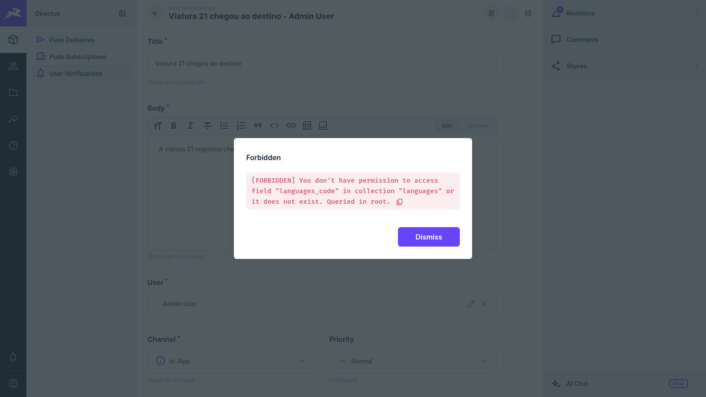
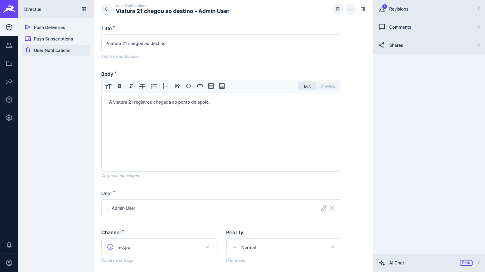
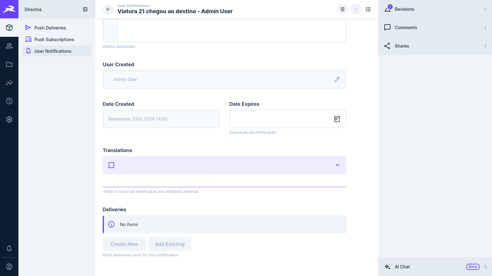
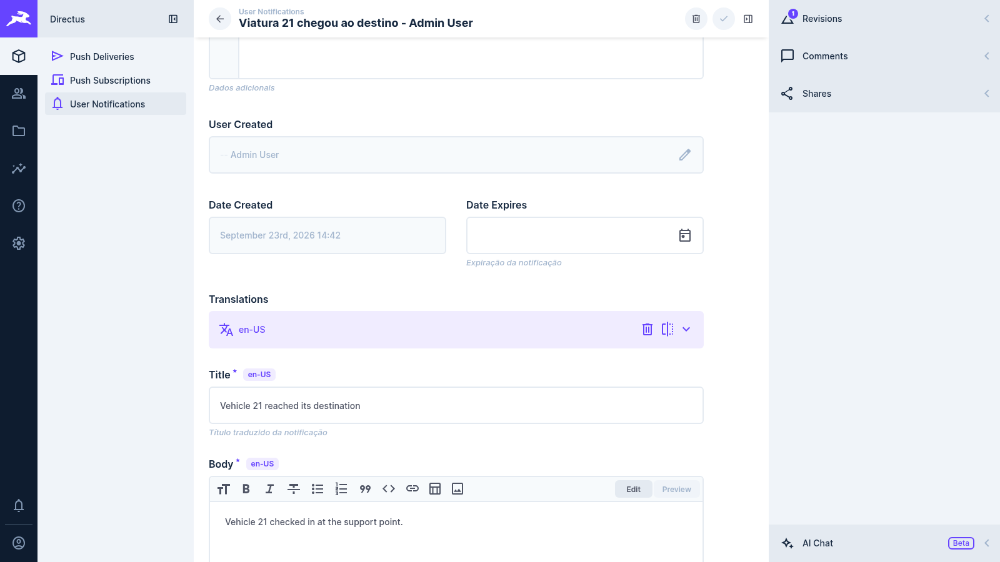
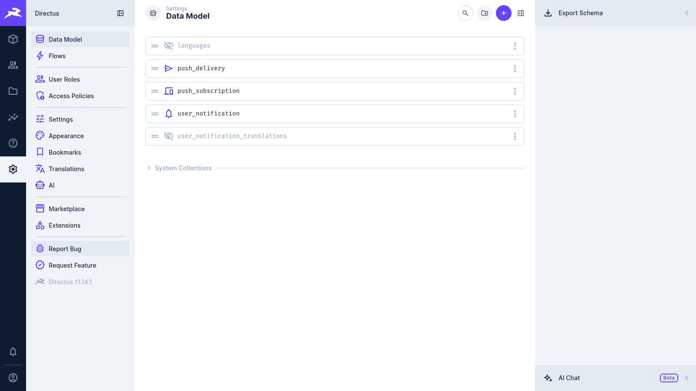
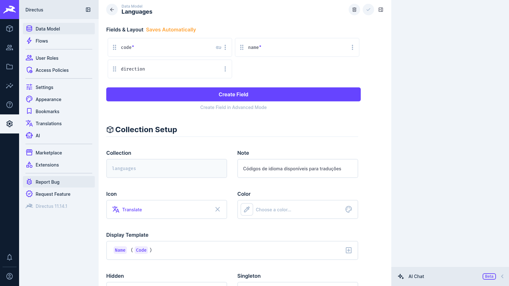

# Task 010 — BREAKING CHANGE: rename languages collection to language

- Status: done
- Type: refactor
- Assignee: Sidarta Veloso

---

## 🚨🚨🚨 BREAKING CHANGE 🚨🚨🚨

> **THIS TASK RENAMES A PUBLIC DATABASE COLLECTION AND DROPS THE OLD ONE.**
>
> |                    |                                                                                  |
> | ------------------ | -------------------------------------------------------------------------------- |
> | **Old collection** | `languages` (plural) — **DROPPED**                                               |
> | **New collection** | `language` (singular)                                                            |
> | **Version impact** | **MAJOR** — `0.x` → **`1.0.0`**                                                  |
> | **Commit footer**  | `BREAKING CHANGE:` is **mandatory** so semantic-release bumps the major          |
> | **Data**           | Migrated automatically; rows already present in `language` are never overwritten |
> | **Rollback**       | Not automatic — restore a database backup                                        |
>
> Any integration querying `/items/languages` **will stop working** and must be
> updated to `/items/language`.

---

## Description

Rename the `languages` collection to the singular **`language`**, which is the
Devix Tecnologia convention and is already used in production by
[`directus-extension-inframe`](https://github.com/devix-tecnologia/directus-extension-inframe).

Today, installing both extensions on the same Directus instance creates **two
collections with exactly the same purpose**, differing only by plural/singular:

```
language    <- created by directus-extension-inframe   (singular, the standard)
languages   <- created by directus-extension-push-notification (plural)
```

That duplication splits the language catalogue in two, makes translations
inconsistent between extensions, and confuses editors in the Directus admin app.
After this task, both extensions converge on the single `language` collection.

### Convention reference (inframe)

`directus-extension-inframe` ships the collection as:

| Field       | Type   | Notes                             |
| ----------- | ------ | --------------------------------- |
| `code`      | string | primary key (`en-US`, `pt-BR`, …) |
| `name`      | string | display name                      |
| `direction` | string | `ltr` / `rtl`                     |

This extension's `languages` collection already has the exact same three fields,
so the migration is a rename plus a data merge — no field mapping is required.

## Scope

### In scope

- `directus-state.json`: collection, fields and relation retargeted to `language`.
- A migration that runs on extension boot (`db-configuration` hook) and:
  1. creates `language` when it does not exist yet (already handled by the
     state-file import, which runs before the migration);
  2. copies every row of the legacy `languages` table that is **missing** in
     `language` (matched by `code`) — existing rows are left untouched;
  3. repoints the `user_notification_translations.languages_code` relation from
     `languages` to `language` through the `RelationsService`;
  4. **confirms no other collection still references `languages`** — if any
     foreign key or `directus_relations` row outside this extension still points
     at it, the drop is **skipped** and a warning is logged;
  5. drops the legacy `languages` collection through the `CollectionsService`
     (never with raw SQL), so Directus cleans up `directus_collections`,
     `directus_fields`, `directus_relations` and the physical table.
- The default-language seeding (46 Directus languages) targets `language`.
- Major version bump via the `BREAKING CHANGE:` commit footer.
- Documentation updates (README, CHANGELOG).

### Out of scope (deliberately)

- **The `user_notification_translations.languages_code` field keeps its name.**
  Only the _collection_ is renamed. Renaming the column would break every
  existing API consumer reading `translations[].languages_code` for no
  convention gain — inframe uses its own junction naming (`language`) and the
  two junction tables are independent.

## Implementation notes

- All schema manipulation goes through Directus services
  (`CollectionsService`, `RelationsService`, `ItemsService`) so Directus'
  internal metadata stays consistent. Raw `knex` is used **only** for read-only
  probing (does the table exist, which rows are missing, which foreign keys
  point at `languages`).
- Order matters: copy rows **before** recreating the foreign key, otherwise the
  new FK to `language.code` fails for codes that only exist in `languages`.
- The migration is **idempotent**: on the second boot there is no `languages`
  collection left and it becomes a no-op.
- The migration never throws; a failure is logged and extension boot continues.

## Tasks

- [x] Write the failing unit tests first (TDD) for the migration module
- [x] Retarget `directus-state.json` from `languages` to `language`
- [x] Implement `src/db-configuration/migrate-languages.ts`
- [x] Wire the migration into the `db-configuration` hook, before language seeding
- [x] Point default-language seeding at `language`
- [x] Update integration/e2e schema expectations
- [x] Update README and CHANGELOG with the breaking change and upgrade steps
- [x] Commit with a `BREAKING CHANGE:` footer so semantic-release releases `1.0.0`

## Test plan (TDD)

Unit tests (`tests/unit/migrate-languages.test.ts`) must cover, at minimum:

| #   | Environment                                            | Expected behaviour                                                                                             |
| --- | ------------------------------------------------------ | -------------------------------------------------------------------------------------------------------------- |
| 1   | Only legacy `languages` exists                         | `language` created by the state import, all rows copied, relation repointed, `languages` dropped               |
| 2   | Only `language` exists (inframe already installed)     | No-op; nothing copied, nothing dropped, no error                                                               |
| 3   | **Both** exist, partially overlapping rows             | Only the missing codes are inserted; pre-existing `language` rows are **not** overwritten; `languages` dropped |
| 4   | Neither exists                                         | No-op; no error                                                                                                |
| 5   | `languages` referenced by a **third-party** collection | Data copied and relation repointed, but the drop is **skipped** with a warning                                 |
| 6   | Drop/copy raises an error                              | Error is logged, migration returns without throwing (boot is never blocked)                                    |
| 7   | Migration runs twice                                   | Second run is a clean no-op (idempotency)                                                                      |

Integration/e2e: the schema validation suite must assert that `language` exists
with `code`/`name`/`direction`, that `languages` no longer exists, and that the
translation flow keeps resolving titles/bodies after the rename.

## Upgrade guide (for the release notes)

1. **Back up the database.** The legacy `languages` table is dropped.
2. Update the extension and restart Directus. The migration runs automatically
   on boot.
3. Replace every `/items/languages` call with `/items/language` in your
   applications, flows and presets.
4. If the migration warns that `languages` is still referenced by another
   collection, repoint that relation and restart Directus to finish the drop.

## Visual evidence

Captured on 2026-09-23 against Directus 11.14.1 (the version the e2e suite runs),
one fresh SQLite database per capture. **Before** is the extension built at
`a38f038`, the last `develop` revision before this task was merged; **after** is
`develop` with the task merged. The only difference between the two captures is
the extension.

**Opening a notification.** This is the defect the rename fixed. Before, opening
any `user_notification` fails with
`[FORBIDDEN] You don't have permission to access field "languages_code" in
collection "languages" or it does not exist`: the translations interface pointed
its `languageField` at `languages_code`, which is the junction's column, not a
field of the languages collection. After, the item opens normally.

| Before                                                  | After                                                   |
| ------------------------------------------------------- | ------------------------------------------------------- |
|  |  |

**The translations field.** Before, the language selector is empty and the two
translations stored through the API (`pt-BR` and `en-US`) do not show up. After,
the selector shows `en-US` with its translated title and body.

| Before                                                  | After                                                   |
| ------------------------------------------------------- | ------------------------------------------------------- |
|  |  |

**The data model.** The five collections the extension creates, with
`languages` becoming `language`.

| Before                                               | After                                                |
| ---------------------------------------------------- | ---------------------------------------------------- |
|  |  |

**The languages collection.** Same fields (`code`, `name`, `direction`) and the
same 46 languages, under the new technical name. The content listing looks the
same in both versions, because it only shows the display name "Languages"; the
technical name is visible here, in the data model.

| Before                                                  | After                                                   |
| ------------------------------------------------------- | ------------------------------------------------------- |
|  |  |

### How the pair was generated

`scripts/captura-telas-evidencia.ts` logs in, creates an `in_app` notification
with two translations (so the extension hook sends no real push), and captures
the four screens. File names follow the geohub convention: the moment goes in the
name, not in a subfolder, so each pair sits side by side in `TASKS/assets/`.

    DIRECTUS_URL=http://localhost:PORT EVIDENCE_TASK=010 EVIDENCE_MOMENT=antes|depois \
      CHROME_CHANNEL=chrome node scripts/captura-telas-evidencia.ts

The script runs on Node 24 without a build step, because Node strips the
TypeScript types itself.

## Notes

- The version in `package.json` is **not** bumped by hand: semantic-release reads
  the `BREAKING CHANGE:` commit footer on `main` and publishes `1.0.0`.
- When this task was implemented, `pnpm run build` could not run in that
  workspace: `dist/` was owned by `root` and held directories named
  `api.js`/`app.js`, left over from a Docker bind mount that ran before a build.
  Integration and e2e suites were not run either.
- Verified on 2026-09-23, after the merge into `develop`: `build`, `lint`,
  `typecheck`, `test:unit` (41) and `format:check` pass under pnpm 11.21.0, and
  the e2e suite passes (41 tests) against Directus 11.14.1.

- Related convention source: `devix/directus-extension-inframe/schema.json`
  (`collection: "language"`).
- Previous i18n work: task 007 (translations) introduced the plural `languages`
  collection that this task retires.
